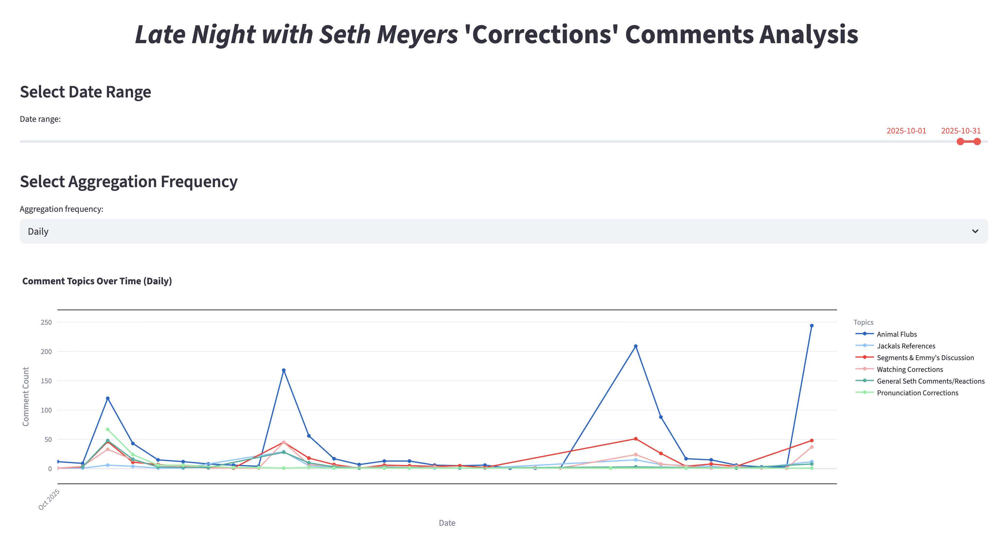
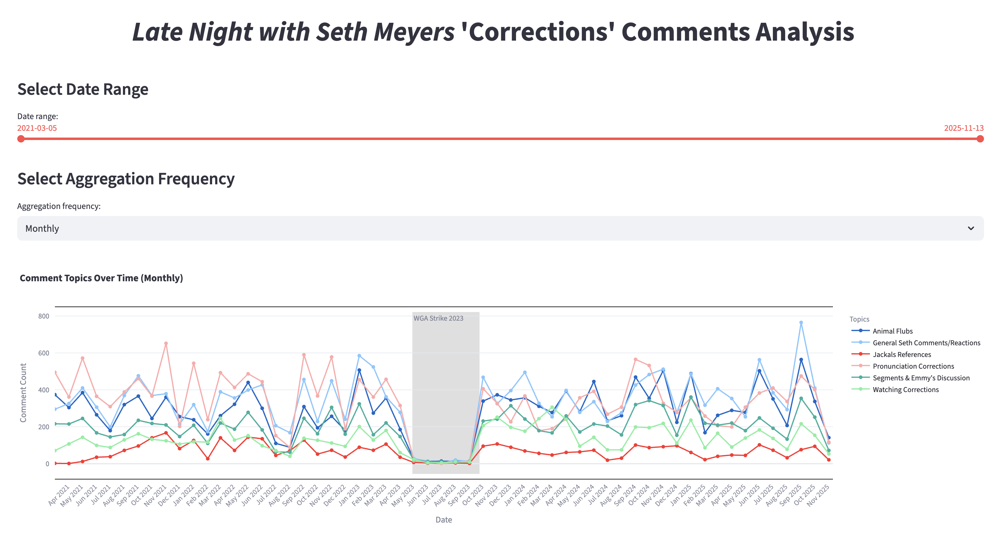
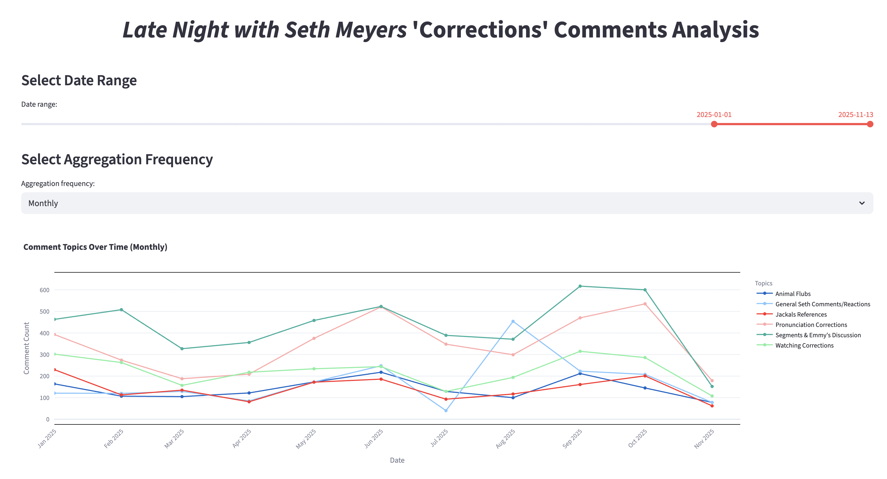

# Corrections Den: An Analysis of *Late Night with Seth Meyers* “Corrections” Comments

This project analyzes viewer comments from the *Late Night with Seth Meyers* YouTube series “Corrections” to uncover recurring themes, audience reactions, and trends in comments over time. Using NLP techniques like TF-IDF, sentence embeddings, and KMeans clustering, the app visualizes how comment topics evolve across episodes.

---

## Features

- **Automated YouTube Data Collection**
  - Fetches video metadata and comments using the YouTube Data API.
  - Filters for “Corrections” videos specifically.

- **Text Cleaning & Preprocessing**
  - Removes noise (links, punctuation, emojis).
  - Normalizes and tokenizes viewer comments.

- **Topic Clustering**
  - Groups comments into topics using sentence embeddings and KMeans.
  - Identifies representative keywords and sample comments per cluster.

- **Interactive Visualization (Streamlit App)**
  - Explore trends and frequencies by topic, date range, and frequency (daily, weekly, monthly).
  - Built with Plotly for dynamic, interactive visualizations.

## App Preview

   
  <em>Daily aggregation view for October 2025</em>

   
  <em>Weekly trends for 2025</em>

   
  <em>Monthly overview</em>

   
  <em>Monthly aggregation focused on 2025</em>

